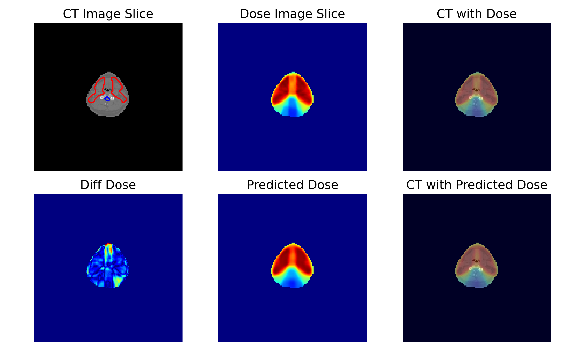

# [DosePrediction](https://github.com/YMZ1998/DosePrediction)

Dose prediction.

Radiotherapy is one of the primary treatment methods for esophageal cancer. 
An essential step in radiotherapy, treatment planning aims to deliver the maximal dose to the planning target volumes (PTV) and the minimal dose to organs at risk (OARs)

## Dataset

[OpenKBP Challenge ](https://github.com/ababier/open-kbp)

[OpenKBP Challenge Results](https://competitions.codalab.org/competitions/23428#results)

```
mkdir Data
git clone https://github.com/ababier/open-kbp.git
```

## Result



## PyInstaller Installation Guide:

```bash
pyinstaller --name DosePrediction --onefile --icon=DP_logo.ico DosePrediction.py
```

```bash
pyinstaller --clean DosePrediction.spec
```


## Reference

[RTDosePrediction](https://github.com/yangsenwxy/RTDosePrediction)
